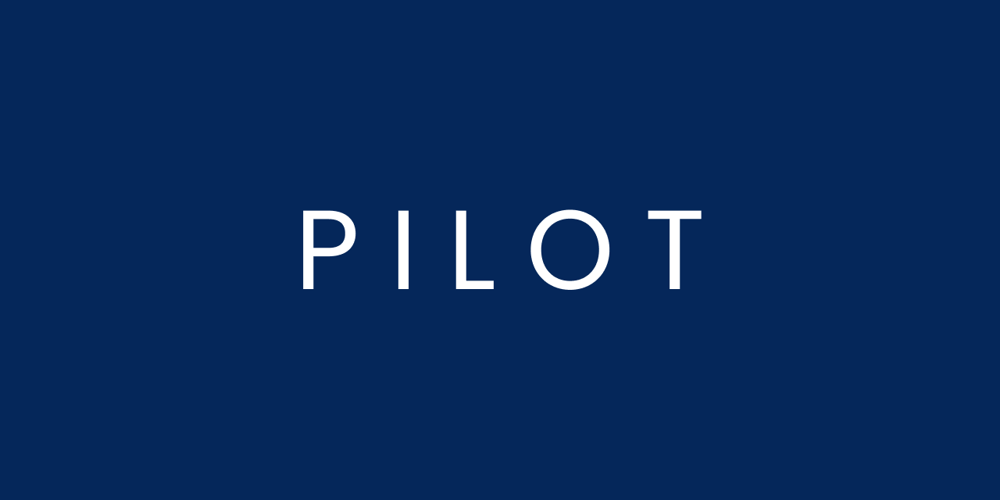
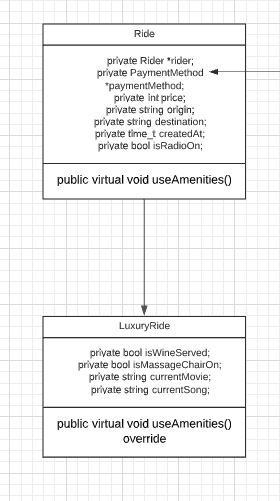
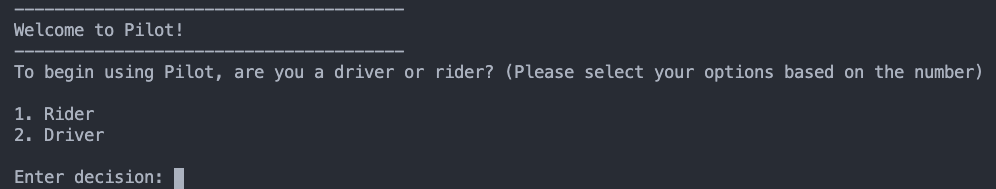

# PILOT

## Introduction

Pilot wants to become a major player in the competitive space of ride-hailing. The main features of the MVP will feature a system for users and drivers. For riders, you can log in, book a ride and top-up money. For drivers, you will be able to cash out, drive customers, and set your status if you are available to receive bookings. In addition, there should be log files to act as a simplified model of the entire business.

Although the exact business logic of how drivers and users interact via message queues and backend servers will not be implemented in this MVP, the user journey should be relatively similar.

Project Duration: May 10 2021 - May 20 2021

Built with C++ using OOP Methodology such as:
- Polymorphism
- Abstract classes
- Interfaces
- Inheritence
- Access specifiers(private, public, protected)

## How to run the program

After cloning the repo, run to build the source files into an executable using:

```bash
make main
```

## Testing

Testing was done without using any testing framework like Google Test. However, unit testing and integration testing were still utilized to automate the testing process, described in the `Makefile`. Regression testing was also used to ensure previous implemented code was still usable.

## UML Diagram



Note: The full diagram of the PILOT's UML can be found at [here](https://www.google.com) 

## User Interface



Because it is a simplified non-production project, PILOT was made in the heart of the familiar command line.

All navigation in the program will be done using the command line, through the display of options available. The user can then enter the number that corresponds to the option that they want.

